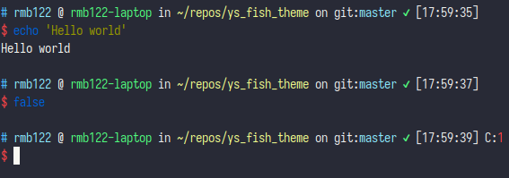

# ys_fish_theme

zsh 的 [ys 主题](https://github.com/ohmyzsh/ohmyzsh/blob/master/themes/ys.zsh-theme) 的 fish 移植版本, 99% 还原度.  

将 `fish_prompt.fish` 放到 `~/.config/fish/functions/fish_prompt.fish` 以启用.  

